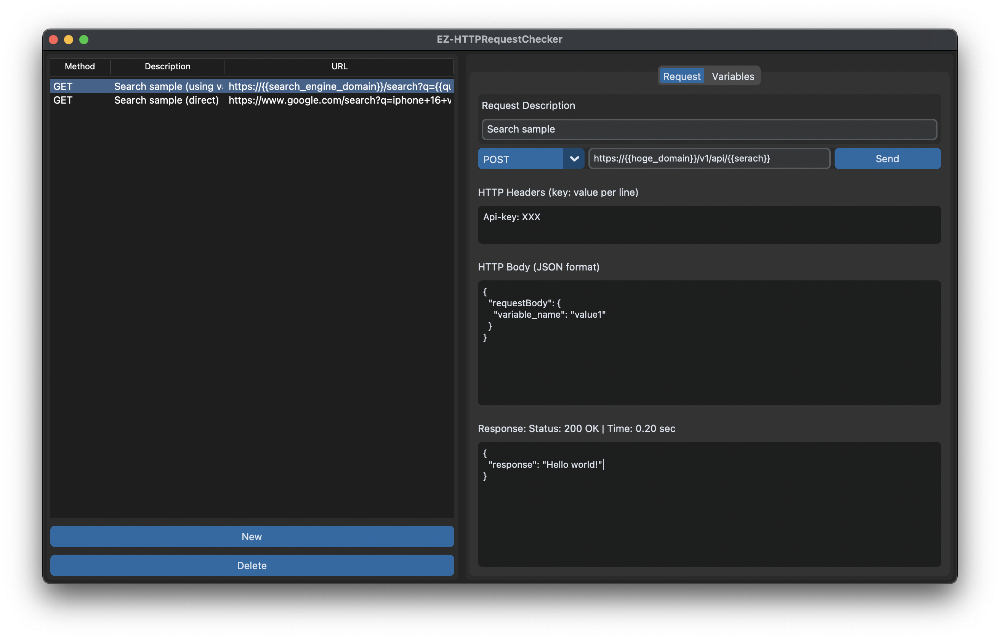

# EZ-HTTPRequestChecker

EZ-HTTPRequestChecker is a lightweight HTTP request testing tool designed for simplicity and ease of use. It provides a straightforward interface to create, send, and store HTTP requests with support for global variables. Please note that while this tool covers many basic needs, it has limitations compared to more advanced applications like Postman.



## 1. Main Features and Limitations

### Main Features
- **Simple Request Creation and Sending:**  
  Easily create HTTP requests (GET, POST, PUT, DELETE) and send them with minimal setup.
- **Global Variable Support:**  
  Define global variables to be used as placeholders (e.g., `{{variable}}`) in the request URL, headers, or body. The original placeholder format is preserved when saving requests.
- **History and Request Storage:**  
  Save executed requests along with full history logs (including complete responses) for future reference.
- **User-Friendly Interface:**  
  An intuitive UI divided into a request list and a detailed request/variable editing panel.

### Limitations Compared to High-End Tools (e.g., Postman)
- **Limited Advanced Features:**  
  Lacks advanced functionalities such as scripting, automated tests, and complex workflow integrations.
- **Simplified Authentication and Environment Management:**  
  Does not offer comprehensive support for various authentication methods or environment configurations.
- **Basic UI:**  
  Designed for ease of use and simplicity, the interface may not cater to all advanced use cases.

## 2. UI Composition

### 2-1. Request List (Left Panel)
- **Display:**  
  A table view that shows all saved requests with columns for HTTP method, request description, and URL.
- **Interaction:**  
  Select a request to view or edit its details, or delete it if no longer needed.

### 2-2. Request Creation and Variable Definition (Right Panel)
- **Request Creation Panel:**  
  - Fields for entering a request description, selecting the HTTP method, specifying the URL, and adding HTTP headers and body.
  - A **Send** button to execute the request.  
- **Variable Definition Tab:**  
  - A dedicated area to add and manage global variables.
  - Users can add variables by specifying a variable name and value.
  - Clicking on a defined variable in the table automatically populates the input fields, making it easier to update the variable.
  - Global variables persist across sessions and are saved together with your request history.

## 3. Getting Started

### 3-1. Creating Python Virtual Environment(venv)

- For macOS (zsh or bash):
```bash
% python -m venv venv 
% source ./venv/bin/activate
(venv) % pip install -r requirements.txt
```

- For Windows(PowerShell):
```bash
PS> python -m venv venv 
PS> .\venv\Scripts\Activate.ps1
(venv) PS> pip install -r requirements.txt
```

### 3-2. [Optional] Customizing UI Language

- Please edit `ui_lang.json` to change UI language.

## 4. How to Use

Run `python main.py` command to start.

### 4-1. Creating and Sending a Request
1. **Enter Request Details:**  
   Fill in the request description, choose the HTTP method, and provide the URL, headers, and body.
2. **Variable Placeholders:**  
   You can include placeholders in the format `{{variable}}` within the URL, headers, or body.
3. **Send Request:**  
   Click the **Send** button. The application will substitute any defined global variables into the request before sending it.
4. **View Response:**  
   The response, including status and up to the first 1000 characters of the body, is displayed in the response area.

### 4-2. Defining and Using Variables
1. **Switch to Variables Tab:**  
   Click the **Variables** tab in the right panel.
2. **Add Variables:**  
   Enter the variable name and value in the provided input fields and click **Add Variable**.
3. **Update Variables:**  
   Click on an existing variable in the table to populate the input fields, then modify the values as needed.
4. **Global Usage:**  
   Any variable defined here can be referenced in your requests using the `{{variable}}` syntax. Changes to variables are saved globally and persist across application sessions.
